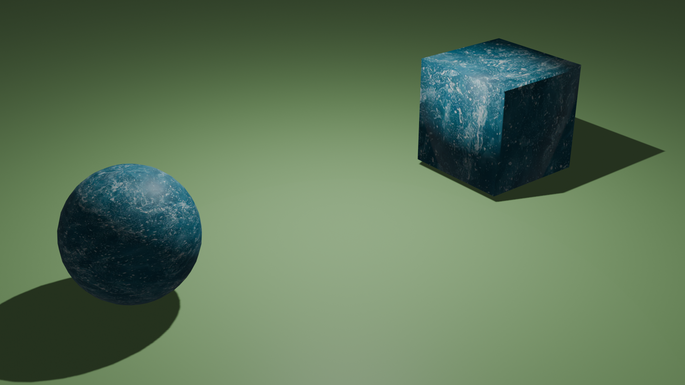

# Block-and-Ball-Effect
Block and Ball Meshes and Textures, generated by blender

Blender 4.0 has used

    
     
    rendered image with texture 1
     

## News 
*2024/07/26: 14 cube & balls are generated with rendered image*

*2024/07/28: extra 21 cube & balls are generated with rendered image*